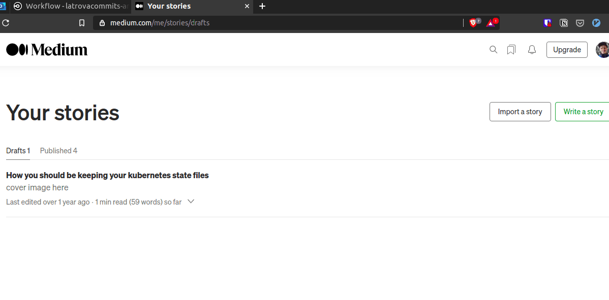

# ✍️ Latrova Commits articles

> Latrova is my last name and every commit is a post, got it? 🤙

I was tired of copying/pasting my posts between my blogs, creatings gists, uploading images.

### Too boring, too manual.

That's why I'm keeping my posts stored public in GitHub. I want to track them (with git), and use CircleCI to manage and publish them for me.



## Automation checklist

- [x] Medium
  - [x] 🇺🇸 [English](https://medium.com/@guilhermelatrova/)
  - [x] 🇧🇷 [Portuguese (Brazil)](https://medium.com/@guilhermelatrova_ptbr/)
- [ ] Personal blog
  - [ ] 🇺🇸 [English](http://www.latrovacommits.com/en/)
  - [ ] 🇧🇷 [Portuguese (Brazil)](http://www.latrovacommits.com/pt/)
- [ ] dev.to

## Automation plan

CircleCi will automate the flow.
Tool for publishing: https://github.com/cjoudrey/md2medium

### 🧬 Code Structure

- High level folder will be year.
- Every post may contain more language versions (it can be less or more, it should be flexible).
- Every post might contains pictures, so it makes sense to keep posts "directory wide".

So we end up with something like:

```
2019/
    2019-03-01_another-topic/
       post.pt-br.md
       post.en-us.md
       img0.jpg

    2019-02-30_topic-y/
       post.en-us.md
       ref.jpg

2018/
   2018-10-10_article-x/
       post.pt-br.md
       thingx.png
       that.png
```

### Commits structure

Standard: `year(post-id): msg`

```
2021(python-exceptions): draft
2021(python-exceptions): first improvement
2021(python-exceptions): revision
```

### :octocat: GitHub flow

- Create a new branch from `master`, you can PR if you want.
- Once new branch is created and pushed it will kick off the flow.

### 🤖 CircleCI flow

- Identify the new post with `git diff`.
- Considering every commit/branch should contain only 1 new post, the result will always be one post changed.
- ~~Assess quality (possibly using grammarly API)~~.
- CircleCI will manage different tokens for different apps.
- Wait user approval to publish.
- Once approved, article is published.

## References

### General
- https://www.portent.com/blog/copywriting/content-strategy/content-with-github-markdown.htm/amp#thefourrulesofcontentworkflow
- https://stackoverflow.com/questions/822811/showing-which-files-have-changed-between-two-revisions

### Medium CLI tools
- https://github.com/cjoudrey/md2medium
- https://github.com/timakin/md2mid
