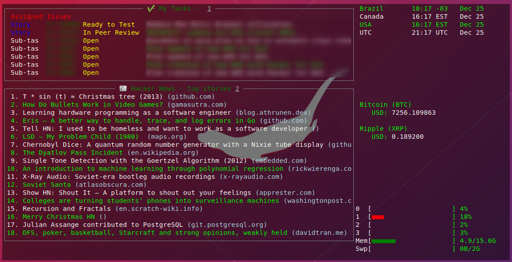

# As a DevOps here's how you should be doing your backups

As a DevOps engineer, there's nothing that I do today that I don't consider how I can automate to be faster and more productive and
recently I noticed everything I have always been doing after formatting my dev notebook, which is pretty much:

1. Backup all my data and settings
2. (Re)Install new OS
3. Restore my backup
4. Set up every single configuration back

Since Ubuntu 19.10 is already there (I have been using 18.04 for a while), I finally found a moment for trying this out.

The main reason for doing this is to migrate between linux dists smoothly and get back to work fast without having to spend the whole weekend setting things up.

That's why I'm going to show you how Ansible can speed you up on setting your environment. Hopefully, it will give some insights on why DevOps is a MUST for every company (and regular developer) nowadays that want to increase productivity. 

If you're curious to see the final result, head out to [https://github.com/guilatrova/base-dev-setup/](https://github.com/guilatrova/base-dev-setup/)

## Why Ansible?

We're going to have several actionable steps that I might want to rerun several times (for backing up my data again or updating a version of a tool), and playbooks fit this perfectly.

From their official site, they claim:
> Ansible is a universal language, unraveling the mystery of how work gets done. Turn tough tasks into repeatable playbooks. Roll out enterprise-wide protocols with the push of a button.


## Backing up all my data with a single command

Rules the playbook should follow to be useful:

**1. Should be stored in the Cloud**
I don't want to worry about having any free space in pen drives or bothering to carry them around. I like having my data always available to me no matter where I am. I decided to go with AWS S3 for this.

**2. Customizable**
It should be extremely easy to add and remove system paths from my backup. I decided to go by setting up a list of variables that would follow the most simple format possible:

```yaml
{
    remote: CLOUD_FOLDER,
    local: LOCAL_FOLDER"
}
```

**3. Easy to trigger**
I should be able to rerun it as many times as I want with a single command without prompts, for this case, it would be: `ansible-playbook playbooks/backup.yml`.

### Result

It's so incredibly simple with Ansible since we can just use `s3_sync` module: [https://github.com/guilatrova/base-dev-setup/blob/master/roles/backup/tasks/main.yml](https://github.com/guilatrova/base-dev-setup/blob/master/roles/backup/tasks/main.yml)

Also, you can filter files (instead of backing up the whole folder contents): [https://github.com/guilatrova/base-dev-setup/blob/master/vars/backup.example.yml](https://github.com/guilatrova/base-dev-setup/blob/master/vars/backup.example.yml)

I did my best to back up my keybindings. I couldn't make it work, though.
Feel free to create a PR if you know a solution for this 😃.

## Restoring all data back

Well, just backing up and not getting it back as easy as before sounds like "not good enough" to me. That's why the playbook for restoring the data should follow the same logic with additional concerns:

**1. Restored files should go back to their original place**
I don't want to worry about moving files. If I have to do any backup step manually, it's simply not good enough.

**2. Handle cases where restored files live in a protected directory**
There are a couple of files, binaries, and scripts I like to keep under `/usr/local/bin`, but this directory has writing protection by default. So sticking to the simplicity goal, the vars file should handle a `sudo: true` prop to specify it requires proper permissions to write to that place.

**3. Packages and binaries should be installed or updated**

I'm not into installing Slack again. I mean, I love setting up my VSCodium IDE, but every time?
Since my computer is my work tool, I need it ready to be used as soon as possible to keep going with my work.

So, this playbook should be able to handle installation (and why not updates?) of all my work tools.

Here's a list of some tools/binaries it installs:

- git
- docker
- vscodium
- mysqlcli
- dbeaver
- npm
- circleci
- slack
- zoom
- terraform
- kubectl
- aws-iam-authenticator
- shellcheck
- tilda
- wtfutil
- moo.do
- tusk
- spotify
- postman
- gitkraken

Some of them may sound new to you, I'll present some of them as a bonus in the end of this article 😃

There's more, feel free to explore the [task](https://github.com/guilatrova/base-dev-setup/blob/master/roles/packages/tasks/main.yml) yourself.

It was designed to allow easy remove/replace of tools, so if you don't want to install cicleci cli for example, it would be as easy as deleting the following lines:

```yaml
- import_tasks: dev/circleci.yml
  tags: circleci, binaries, dev
```

The same applies if you're willing on just updating/reinstalling some tool. You should be able to filter it by tags.

**4. Repositories should be cloned again**
Well, I'm working following a microservices architecture. What means I have several "micro" repositories with its own purposes. I hate when I try to open a repository that I haven't cloned yet.

That's why the last piece of the whole process is cloning all repositories I'm using.

I have split it by 2 main groups "personal" and "company", so you can clone both repositories in different folders if you want.

The same "easy to customize" logic applies here, you have vars where you just have to specify a list of repositories and then ansible will do everything for you:

```yaml
company_org: "my-company-org"
company_repo_dest: "{{ home_folder }}/my-company/"
company_repos:
  - "my-company-repo"
  - "my-second-company-repo"
```
## What else can I do with Ansible?

As you have noticed, ansible can automate **pretty much anything**. If your company still doesn't use an automation tool, start noticing what repeated steps you/your team takes every week. From backups (as showed here) to [adding new members and managing roles on AWS](https://docs.ansible.com/ansible/latest/modules/iam_module.html), Ansible may help you!

In a century where companies and startups are willing to deliver more and hit market faster, we need to figure out ways to do less while still doing more.

The sooner your company realizes how much time it can save by automating repetitive tasks, sooner it will allocate more meaningful work for its engineers that brings actual value to its product.

## 🚀 Bonus: Tools suggestions to boost productivity and privacy

You might have noticed that I got a couple interesting tools being installed, like [VSCodium](https://vscodium.com/) (instead of VSCode) and [Moo.do](https://www.moo.do/).

Let me present to you some of my daily tool choices (and why) that might help you.

#### VSCodium

It's just a _VSCode without Microsoft telemetry/tracking_. From their homepage:

> Microsoft’s vscode source code is open source (MIT-licensed), but the product available for download (Visual Studio Code) is licensed under this not-FLOSS license and contains telemetry/tracking. According to this comment from a Visual Studio Code maintainer: [...]

#### Shellcheck

**It's a MUST for any developer that creates bash scripts** from once in a while. It lints your code and helps you avoid some known mistakes.

#### wtfutil

Besides the funny name, this tool is very useful (I like to run it in Tilda) and helps me keep an eye on the latest [Hacker News](https://news.ycombinator.com) and my current Jira tasks.



#### Moo.do

That's my favorite tool to help me focus on what matters, without loosing track of my emails and important events in my agenda. It's insanely easy to use, you can make a task an event, an email a task and so on.
