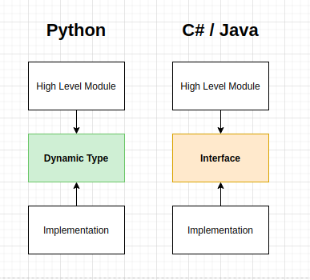
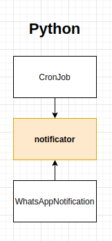

# Thoughts on Python Dependency Injection

### Glossary Cheat Sheet

Before we dive into it, let's review some acronyms and what they represent:

- **DIP** `(Dependency Inversion Principle)` is a principle.
- **IOC** `(Inversion Of Control)` is a principle.
- **DI** `(Dependency Injection)` is a pattern.
- **IOC Container** is a framework.

## Introduction

The first thing that I thought that was missing when I came from a C# background to Python was:

> What should I use for Dependency Injection? How can I create interfaces?

And looks like that's a pretty common question from anyone coming from a typed language background, based on these stack overflow questions:

- https://stackoverflow.com/questions/2461702/why-is-ioc-di-not-common-in-python
- https://stackoverflow.com/questions/31678827/what-is-a-pythonic-way-for-dependency-injection
- https://stackoverflow.com/questions/156230/python-dependency-injection-framework
- https://stackoverflow.com/questions/2124190/how-do-i-implement-interfaces-in-python

Please, note how all these questions always mentions: _"Well, in Java/C#/other language..."_. Let me interrupt it right there because, **well, you're not in Java, C# or anything else**, so how should you face this problem?

# 🤔 What's Dependency Inversion Principle and why should I care about?

Let me make it simple, inversion of control states that your code should respect two rules:

- Modules should not depend on implementations, but abstractions instead;
- Implementations should depend on abstractions;


In other words, you can achieve that in C# with something like:

```csharp
public interface IDependency
{
    void work();
}

public class Implementation : IDependency
{
    public void work()
    {
        Console.WriteLine("Implementation of Work!");
    }
}

public class Module
{
    private IDependency dependency;

    public Module(dependency: IDependency)
    {
        this.dependency = dependency;
    }

    public doWork()
    {
        this.dependency.work();
    }
}

```

Ok, note how `Module` knows **nothing** about `Implementation`, and how `Implementation` knows **nothing** about `Module` - Instead, both of them know only `IDependency` which can be seen as a contract between them that says: _"Hey, you should implement method `work` with no args and return `void`"_.

Cool, got it, why should I care? Well, it brings us a couple of benefits:

- You can replace anytime `Implementation` with other variations of code (Think about an `INotification` that has `WhatsAppNotification` and `SMSNotification` so you can switch between them anytime)
- Your code can be tested isolated, since you can mock an `IDependency`

This makes your code insanely scalable, **you should write code like that always**.

(Honestly, I can't imagine a high quality C#/Java code that does not respect this rule.)

# ⛓️ Python does not have interfaces

That's damn trick, how am I suppose to depend on abstractions if Python doesn't support interfaces?


Well, there's the `ABC` module that would allow you to write an abstract class **disguised** as an interface. But honestly, I don't believe Python need interfaces.

That's somewhat shocking, after researching a lot on StackOverflow and other posts, I came up to a conclusion:

### Interface is a solution for languages that does not support multiple-inheritance.

And guess what? Python supports it (I won't talk about the diamond problem caused by such decision).

> Languages that allow only single inheritance, where a class can only derive from one base class, do not have the diamond problem. The reason for this is that such languages have at most one implementation of any method at any level in the inheritance chain regardless of the repetition or placement of methods. Typically these languages allow classes to implement multiple protocols, called interfaces in Java. These protocols define methods but do not provide concrete implementations. This strategy has been used by ActionScript, C#, D, Java, Nemerle, Object Pascal, Objective-C, Smalltalk, Swift and PHP.[13] All these languages allow classes to implement multiple protocols.

[_From Wikipedia._](https://en.wikipedia.org/wiki/Multiple_inheritance)


> **NOTE: Abstract classes**
>
> An Abstract Class is a way of sharing behaviors and implementations between its subclasses and **also** enforcing some contract between subclasses. You should use it if required, **my advice is not against abstract classes, but "_pure_" disguised abstract classes as interfaces**.


Ok, but **how can I enforce a contract, then?** How can I guarantee that my implementation has all required methods and details?

Well, that brings us to the next topic, which is:

# 🦆 Python is dynamically typed

Man, have you realized that you need to specify types in some languages, but not in python? ([type hinting](https://docs.python.org/3/library/typing.html) does not enforce it btw).

Look at the following python function:

```python
def sum_join(v1, v2):
    return v1 + v2
```

This function does not care about what passes, it will return the "sum" of 2 arguments.

This means that you can use it like:

```python
sum_join(1, 1)     # produces 2
sum_join("a", "b") # produces "ab"
```

Such thing is called **duck typing**, a concept that says: _if it quacks like a duck then it must be a duck_.

In other words, your code assumes that having the methods/functions that you need means your implementation is fine.

That's very powerful. But with great powers comes great responsibility. So I'll repeat the question:

**How can I enforce a contract?** How can I rest assured that my code has implemented everything needed, and for God Sake it's taking args and returning correctly?

Well, you can't. At least, not with regular classes.

How to solve that problem then? Well, I would ask you, regardless of how you enforce things, how would you prove me that your code implementation is correct and works for real?

# 🧪 Unit Testing is the key

The same way you SHOULD test that a function returns the expected result, you should test that your implementation works fine in your code.

And that's it, you don't need an interpreter to force you to do stuff, you're grown up, you can ensure you did it yourself.

Let me try to prove my point, because talk is cheap.

Let's consider we have a CronJob that runs every hour and we want to be notified _somehow_ whenever it gets executed.

```python
class CronJob:
    def __init__(self, notificator):
        self.notificator = notificator

    def execute(self):
        print("Executing cron job")
        notification_emitted = self.notificator.send("Job has been executed")
        if not notification_emitted:
            raise Exception("Notification failed")
```

Note that we're receiving a "notificator" and it should contain a `send` method - and that's it.

On C# you would implement it as:

```csharp
public interface INotificator
{
    bool send(String message);
}

public class WhatsAppNotification : INotificator
{
    public bool send(String message)
    {
        Console.WriteLine("Sending notification through Whatsapp");
        return true;
    }
}
```

Now in python, let's imagine we have 3 implementations with 1 not respecting our `send` method.

```python
class WhatsAppNotification:
    def send(self, msg):
        print("Sending notification through Whatsapp")
        return True


class EmailNotification:
    def send(self, msg):
        print("Sending notification through Email")
        return True


class TelegramNotification:
    def notificate(self, msg):
        print("Not respecting contract")
```

How can we ensure we're not sending this broken `TelegramNotification` into production and ruining the whole thing?

We can have these unit tests to ensure everything works:

```python
from unittest.mock import patch
import pytest
import notifications
from jobs import CronJob


class TestValidContract:
    """Test job dependency with different implementations
    """
    def test_job_notificates_through_whatsapp(self):
        job = CronJob(notifications.WhatsAppNotification())
        job.execute()

    def test_job_notificates_through_email(self):
        job = CronJob(notifications.EmailNotification())
        job.execute()

    def test_job_throws_exception_when_notification_fails(self):
        """Mocks notificator to return False
        """
        notificator = notifications.WhatsAppNotification()
        with patch.object(notificator, "send", return_value=False):
            with pytest.raises(Exception):
                job = CronJob(notificator)
                job.execute()


class TestBrokenContract:
    """Suite of tests that prove Telegram is not respecting
    its contract.
    """

    def test_telegram_throws_exception_when_notification_fails(self):
        """Mocking notificator does not fix a broken
        contract
        """
        notificator = notifications.TelegramNotification()
        with patch.object(notificator, "send", return_value=False):
            with pytest.raises(Exception):
                job = CronJob(notificator)
                job.execute()

    def test_job_notificates_through_telegram(self):
        """This test will fail because
        Telegram implementation does not respect contract
        """
        job = CronJob(notifications.TelegramNotification())
        job.execute()
```

I decided to split the working suite from the failing one to make it easier to spot.

Note what's really interesting

- Mocking does not "fix" a broken contract
- No interfaces have been written, we still proved that the implementation works

But hey, don't trust me, please go straight to the repository, clone it execute and see it by yourself on
**[GitHub](https://github.com/guilatrova/python-ensure-contract)**

I'm adding to the source code a scenario where I believe it would be fine to implement abstract classes as well.

# 🐍 Can we implement it on Python?

**Yes!** but that may depend on how you see things though.

Again, Inversion of Control Principle states that:

- Modules must depends on abstractions;
- Implementations must depends on abstractions;

and that's how I honestly see it now:



**A python dynamic type that can be anything is the abstraction.**

So, based on our examples, that's how we can see it:



`notificator` (the argument inside `CronJob`), is an abstraction and `WhatsAppNotification` is the actual implementation.

But please note, `CronJob` receives an implementation through the abstraction, that's why we're respecting the principle.

## Examples

**Abstract classes**

I have absolutely nothing against abstract classes, I use them quite often by the way. I'm just opposed to writing more lines of code that don't add value. If you're writing unit tests (I really hope you are) why to enforce the same thing twice?

If you have an actual behavior that you want to share, then it starts making sense to me. You need to ensure a base class has something to share, without deciding details of the implementation.

(See this example for a valid reason on using abstract classes: [GitHub](https://github.com/guilatrova/python-ensure-contract/tree/master/abstract)).

**Dependency Injection on classes**

As the example showed above, it does respect the principle:

```python
class CronJob:
    def __init__(self, notificator):
        self.notificator = notificator
```

By allowing our `CronJob` to receive anything that's perfectly ok.
You might also provide a default, so you can do it like:

```python
class CronJob:
    def __init__(self, notificator=None):
        self.notificator = notificator or WhatsAppNotification()
```

If you allow your code to take ANY implementation, then IMHO it still respects this principle.

**Dependency Injection on modules**

Different from other languages python has "modules" that can contain several functions.

In such scenario there's no constructor to inject the implementation.

So I often end up doing:

```python
notificator = WhatsAppNotification()

def execute_job():
    notificator.send("Job executed")
```

See? `notificator` is now a module dependency, and it can be anything thanks to Duck Typing. We need to implement unit tests to ensure that our notificator respects the `send` contract.

**KISP: Keep It Simple, Pythonista - no IoC Containers**

Again, if you come from other languages, you probably are familiar with a few IoC Containers.

I can't see a good reason to implement them in Python. Your code gets verbose, new developers don't really understand what's happening behind your code (honestly neither do I lol).

Why to add more lines to your code if you can achieve:

- Loosely coupled code
- Highly testable code

without an IoC framework?


# ⭐ Conclusion

Let's wrap it up:

- Respect and honor DIP to achieve high quality decoupled code;
- Python does not have interfaces, you should write unit tests to ensure contracts are respected;
- Abstract classes are welcome when you want to share some behavior;
- You don't need IoC containers;

Do you disagree? Please **reply and point out my weak spots**, so we can learn more together 😃. Example code is encouraged and can enrich the experience.

### 🔖 References

I relied on a few links to write this article:

- [SOLID Python: SOLID principles applied to a dynamic programming language](https://www.researchgate.net/publication/323935872_SOLID_Python_SOLID_principles_applied_to_a_dynamic_programming_language)
- [Stack Overflow: What is duck typing?](https://stackoverflow.com/questions/4205130/what-is-duck-typing)
- [IoC Introduction](https://www.tutorialsteacher.com/ioc/introduction)
- [IoC Techniques](https://seddonym.me/2019/08/03/ioc-techniques/)
- [Three Techniques for Inverting Control, in Python](https://seddonym.me/2019/08/03/ioc-techniques/)

