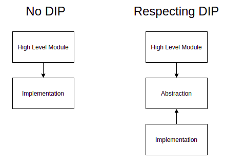

# Thoughts on Python Dependency Injection

The first thing that I thought that was missing when I came from a C# background to Python was:

> What should I use for Dependency Injection? How can I create interfaces?

And looks like that's a pretty common question from anyone coming from a typed language background, based on these stack overflow questions:

- https://stackoverflow.com/questions/2461702/why-is-ioc-di-not-common-in-python
- https://stackoverflow.com/questions/31678827/what-is-a-pythonic-way-for-dependency-injection
- https://stackoverflow.com/questions/156230/python-dependency-injection-framework
- https://stackoverflow.com/questions/2124190/how-do-i-implement-interfaces-in-python

Please, note how all these questions always mentions: _"Well, in Java/C#/other language..."_. Let me interrupt it right there because, **well, you're not in Java, C# or anything else**, so how should you face this problem?

# What's Inversion of Control and why should I care about?

Let me make it simple, inversion of control states that your code should respect two rules:

- Modules should not depend on implementations, but abstractions instead;
- Implementations should depend on abstractions;



In other words, you can achieve that in C# with something like:

```csharp
public interface IDependency
{
    void work();
}

public class Implementation : IDependency
{
    public void work()
    {
        Console.WriteLine("Implementation of Work!");
    }
}

public class Module
{
    private IDependency dependency;

    public Module(dependency: IDependency)
    {
        this.dependency = dependency;
    }

    public doWork()
    {
        this.dependency.work();
    }
}

```

Ok, note how `Module` knows **nothing** about `Implementation`, and how `Implementation` knows **nothing** about `Module` - Instead, both of them know only `IDependency` which can be seen as a contract between them that says: _"Hey, you should implement method `work` with no args and return `void`"_.

Cool, got it, why should I care? Well, it brings us a couple of benefits:

- You can replace anytime `Implementation` with other variations of code (Think about an `INotification` that has `WhatsAppNotification` and `SMSNotification` so you can switch between them anytime)
- Your code can be tested isolated, since you can mock an `IDependency`

This makes your code insanely scalable, **you should write code like that always**.

## Python does not have interfaces

That's damn trick, how am I suppose to depend on abstractions if Python doesn't support interfaces?


Well, there's the `ABC` module that would allow you to write a abstract class **disguised** as an interface. But honestly, I don't believe Python need interfaces.

That's somewhat shocking, after researching a lot on StackOverflow an other posts, I came up to a conclusion:

### Interface is a solution for languages that does not support multiple-inheritance.

And guess what? Python supports it (I won't talk about the diamond problem caused by such decision).

> Languages that allow only single inheritance, where a class can only derive from one base class, do not have the diamond problem. The reason for this is that such languages have at most one implementation of any method at any level in the inheritance chain regardless of the repetition or placement of methods. Typically these languages allow classes to implement multiple protocols, called interfaces in Java. These protocols define methods but do not provide concrete implementations. This strategy has been used by ActionScript, C#, D, Java, Nemerle, Object Pascal, Objective-C, Smalltalk, Swift and PHP.[13] All these languages allow classes to implement multiple protocols.

[_From Wikipedia._](https://en.wikipedia.org/wiki/Multiple_inheritance)
