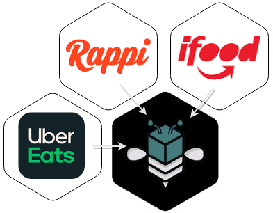
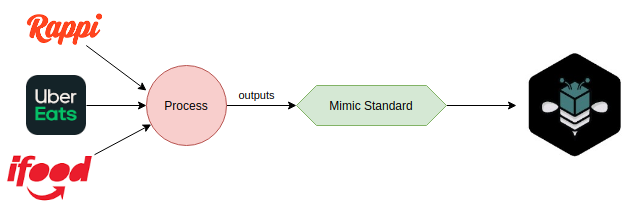
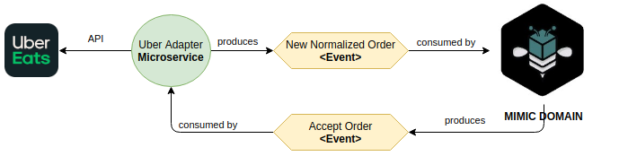
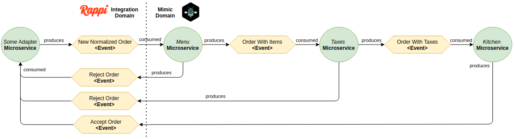

# How we built an agnostic microservice platform for all integrations

At Mimic, we have the challenge of integrating with several third parties ([ifood](https://techcrunch.com/tag/ifood/), [Uber](https://techcrunch.com/tag/uber-eats/), [Rappi](https://techcrunch.com/tag/rappi/)) without exposing/leaking details to our main microservice. Each integration has its challenges as [I discussed briefly before](https://blog.guilatrova.dev/architectural-challenges-on-integrating-rappi/) in this blog, but in the end, all the details should be solved individually and finally somehow fit in our external interface.

In that sense, the kitchen does not have to understand the inner details of each integration. Instead, we must make common or **normalize** the orders to a known standard that our system understands.



## How microservices communicate between each other

The APIs may be different, the endpoints, the authentication, the payloads, and everything else, but all of them work around the same concepts, so it's safe to say that:

- A customer ordered it
- The order has items
- Items may contain modifications (e.g. toppings)
- Items has prices
- The order may contain modifications (e.g. discounts)
- The order may contain one or several payments
- Some courier will deliver it

With this core set of data, it allowed us to create a "Mimic standard" and **adapt** (analogous idea to the [adapter design pattern](https://refactoring.guru/design-patterns/adapter) but at the microservice level) every integration individually.

We rely on **Kafka** for transmitting events (i.e. messages) between microservices.
We use [**protocol buffers**](https://developers.google.com/protocol-buffers) to defining the message body and enforce standards without being attached to a single language.

At a macro level, our "Mimic" microservice has no idea whether an order came from Rappi or Uber:



And it can be processed independently of which aggregator it is.
Mimic microservice doesn't care about details, it only cares about correctly responding to events and producing another set of events.

It allows us to scale and iterate very fast. What if we need to integrate new third parties? Easy! Integrate it, adapt it, and DONE!

## Getting micro

Having many small microservices allow us to work better as a team. We can work on several integrations in parallel without interrupting each other.

Also, if one integration breaks, it doesn't affect others.

Each integration only needs to understand two thing:

- Who I'm talking to? (e.g. Uber)
- What internal events should I respond to? (e.g. Accepting the order, Cancelling the order)



Following such rules means there are no implementation details anywhere except inside each microservice, which is great since we encapsulate logic and challenges inside each scope.

Updates to any API affect only one single microservice.

## Events enhancement

Inside Mimic's domain, we have several microservices as well, each one dedicated to handling one aspect of our system. For this article, I'll use only "*menu catalog*" and "*taxes*" for example.

Once an event is normalized it starts getting enhanced until it arrives in a final ready state that can be used and consumed by our Kitchen.

Sometimes an ordered item is not available or contains invalid information, which makes sense to us to run a menu validation for every item. If everything is fine we move on to taxes, if anything is wrong we produce a "reject event".

The same idea repeats in our Taxes system. We run several internal validations to ensure the order contains correct pricing and discount logic. Anything weird or wrong produces a reject event with alarms to get our team investigating ASAP.



## At the code level

It might sound like the normalizing step gets easier now since we have very specific microservices for every step, but remember we still have to handle and populate all fields to the normalized state. So our adapter needs to know where to put item fields, pricing fields, discount fields, customer fields, etc.

After doing it a couple of times we realized that the [chain of responsibility pattern](https://refactoring.guru/design-patterns/chain-of-responsibility) plays really well to achieve that. Consider that always there's an API sending us a big payload that we need to adapt at several levels to produce a final model (aka "Mimic Standard").

So we have our interface:

```py
# Interface
from abc import ABC, abstractmethod
from typing import Optional

from mimic_schema import NormalizedOrder

from ifood_adapter.models import IfoodOrderPayload


class BaseHandler(ABC):
    _next_handler: Optional["BaseHandler"] = None

    def then(self, handler: "BaseHandler") -> "BaseHandler":
        self._next_handler = handler
        return self._next_handler

    def adapt(
        self, event: IfoodOrderPayload, order: NormalizedOrder
    ) -> NormalizedOrder:
        order = self._execute(event, order)

        if self._next_handler:
            return self._next_handler.adapt(event, order)

        return order

    @abstractmethod
    def _execute(
        self, event: IfoodOrderPayload, order: NormalizedOrder
    ) -> NormalizedOrder:
        pass
```

And then we can implement and use our handlers as:

```py
# The order matters for the correct processing of the data!
EXECUTION_ORDER = (
    handlers.ClientHandler,
    handlers.DeliveryServiceHandle,
    handlers.PaymentsHandler,
    handlers.TaxesHandler,
    handlers.ProductsHandler,
)


def create_adapter():
    full_handler = handlers.GeneralHandler()  # Instantiate the first handler
    cur_handler = full_handler

    # Iteratively build the final adapter chain in the correct order
    for handler_class in EXECUTION_ORDER:
        next_handler = handler_class()
        cur_handler = cur_handler.then(next_handler)

    return full_handler


def main():
    order_details = IfoodOrderPayload.parse_obj(raw_order)
    adapter = create_adapter()

    empty_order = self._create_order()  # Creates an empty order object
    result = adapter.adapt(order_details, empty_order)  # Returns the same object filled
```

By breaking down our final model into small handlers we allow:

- **Developers to move on working on the same adapter in parallel** (e.g. I do products handling, you do customer handling)
- **Smaller units tests** (e.g. One test class per handler)
- **Faster reviews and make it easier to spot mistakes** (e.g. On discounts you forgot to consider toppings)
- **Infinite improvements by adding as much handlers as we wish** (e.g. Let's break down discounts into customer loyalty discounts)

We had an amazing experience by picking this design pattern to solve this particular issue.

What do you think? Do you see any challenges that we could have done easier?
