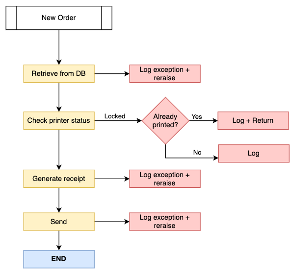

# Handling exceptions in Python like a pro 🐍 💣

One of the downsides of a flexible language like python is that people often assume that as long as something works then it's probably the proper way of doing so. I would like to write this humble guide on how to effectively use python exceptions and how to handle exceptions and log them correctly.

## Handling exceptions effectively

### Intro

Let's consider the following system, a microservice responsible for:

- Listening to new order events;
- Retrieving the order from database
- Checking printer status;
- Printing the receipt;
- Sending receipts to the Internal Revenue System (IRS);



Anything can break at any moment. You might have trouble with the order object missing important information, or maybe your printer is out of paper, maybe the IRS is out of service and you can't sync the receipt with them, or maybe, who knows, your database is unavaiable at the moment.

You must respond to any situation properly and proactively to mitigate errors when handling new orders.

And this is the actual kind of code (which althought works, it's bad and ineffective) that I see people writing:

```py
class OrderService:
    def emit(self, order_id: str) -> dict:

        try:
            order_status = status_service.get_order_status(order_id)
        except Exception as e:
            logger.exception(
                f"Order {order_id} was not found in db "
                f"to emit. Error: {e}."
            )
            raise e

        (
            is_order_locked_in_emission,
            seconds_in_emission,
        ) = status_service.is_order_locked_in_emission(order_id)
        if is_order_locked_in_emission:
            logger.info(
                "Redoing emission because "
                "it was locked in that state after a long time! "
                f"Time spent in that state: {seconds_in_emission} seconds "
                f"Order: {order_id}, "
                f"order_status: {order_status.value}"
            )

        elif order_status == OrderStatus.EMISSION_IN_PROGRESS:
            logger.info("Aborting emission request because it is already in progress!")
            return {"order_id": order_id, "order_status": order_status.value}

        elif order_status == OrderStatus.EMISSION_SUCCESSFUL:
            logger.info(
                "Aborting emission because it already happened! "
                f"Order: {order_id}, "
                f"order_status: {order_status.value}"
            )
            return {"order_id": order_id, "order_status": order_status.value}

        try:
            receipt_note = receipt_service.create(order_id)
        except Exception as e:
            logger.exception(
                "Error found during emission! "
                f"Order: {order_id}, "
                f"exception: {e}"
            )
            raise e

        try:
            broker.emit_receipt_note(receipt_note)
        except Exception as e:
            logger.exception(
                "Emission failed! "
                f"Order: {order_id}, "
                f"exception: {e}"
            )
            raise e

        order_status = status_service.get_order_status(order_id)
        return {"order_id": order_id, "order_status": order_status.value}
```

I'll focus first on `OrderService` excessive knowledge which makes him somewhat a [Blob](https://sourcemaking.com/antipatterns/the-blob) and later on I will explore proper reraising + proper exception logging.

### Why is this service a blob

This service knows too much. Some people may argue that this service only knows about what it should know (i.e. all steps related to receipt generation), but it knows way more than that.

It focuses on producing errors (e.g. database, printing, order status) instead of what it does (e.g. retrieve, check status, generate, send) and how to respond in case of failures.

In that sense, it makes me feel that the client is teaching the serving class what exceptions it might produce. If we decide to reuse it in any other step  (let's say a customer wants another printed copy from an older order receipt), we would be replicating most of this code.

Although this service works fine, it's hard to maintain, and it's not clear how one step correlates to the other due the repeated `except` blocks between every step which take away our attention on the "how" to think about "when".

### 1️⃣ First improvement: Make exceptions specific

Let's make the exceptions more accurate and specific first.
The benefits can't be seen right away, so I'll not spend too much time explaining it right now. But please, pay attention as the code evolves.

I will only highlight what we modified:

```py
try:
    order_status = status_service.get_order_status(order_id)
except Exception as e:
    logger.exception(...)
    raise OrderNotFound(order_id) from e

...

try:
    ...
except Exception as e:
    logger.exception(...)
    raise ReceiptGenerationFailed(order_id) from e

try:
    broker.emit_receipt_note(receipt_note)
except Exception as e:
    logger.exception(...)
    raise ReceiptEmissionFailed(order_id) from e
```

Note that this time I'm also benefiting of using `from e` which is the correct way of raising an exception from another and keeps the full stack trace.

### 2️⃣ Second improvement: Mind your own bussiness

Now that we have custom exceptions, we can move on "don't teaching classes what can go wrong" - they will report to us if it happens!

```py
# Services

class StatusService:
    def get_order_status(order_id):
        try:
            ...
        except Exception as e:
            raise OrderNotFound(order_id) from e


class ReceiptService:
    def create(order_id):
        try:
            ...
        except Exception as e:
            raise ReceiptGenerationFailed(order_id) from e


class Broker:
    def emit_receipt_note(receipt_note):
        try:
            ...
        except Exception as e:
            raise ReceiptEmissionFailed(order_id) from e

# Main class

class OrderService:
    def emit(self, order_id: str) -> dict:
        try:
            order_status = status_service.get_order_status(order_id)

            (
                is_order_locked_in_emission,
                seconds_in_emission,
            ) = status_service.is_order_locked_in_emission(order_id)
            if is_order_locked_in_emission:
                logger.info(
                    "Redoing emission because "
                    "it was locked in that state after a long time! "
                    f"Time spent in that state: {seconds_in_emission} seconds "
                    f"Order: {order_id}, "
                    f"order_status: {order_status.value}"
                )

            elif order_status == OrderStatus.EMISSION_IN_PROGRESS:
                logger.info("Aborting emission request because it is already in progress!")
                return {"order_id": order_id, "order_status": order_status.value}

            elif order_status == OrderStatus.EMISSION_SUCCESSFUL:
                logger.info(
                    "Aborting emission because it already happened! "
                    f"Order: {order_id}, "
                    f"order_status: {order_status.value}"
                )
                return {"order_id": order_id, "order_status": order_status.value}

            receipt_note = receipt_service.create(order_id)
            broker.emit_receipt_note(receipt_note)
            order_status = status_service.get_order_status(order_id)
        except OrderNotFound as e:
            logger.exception(
                f"Order {order_id} was not found in db "
                f"to emit. Error: {e}."
            )
            raise
        except ReceiptGenerationFailed as e:
            logger.exception(
                "Error found during emission! "
                f"Order: {order_id}, "
                f"exception: {e}"
            )
            raise
        except ReceiptEmissionFailed as e:
            logger.exception(
                "Emission failed! "
                f"Order: {order_id}, "
                f"exception: {e}"
            )
            raise
        else:
            return {"order_id": order_id, "order_status": order_status.value}
```

How does it feel? Much better, right? You have a single `try` block where you can logically follow to understand what happens next, you have grouped specific `except` blocks that helps you understand the "when" situations and edge cases, and lastly you have a `else` block outlining what would happen if everything is successful.

Also, please note that I kept the "reraise" statements `raise` without redeclaring the exception object. It's not a typo. Actually that's the correct way of reraising the current exception: Simple, not verbose.

I'm still not happy though. These logs are annoying me.

### 3️⃣ Third improvement: Better logging

This step reminds me of the [Tell Don't Ask principle](https://martinfowler.com/bliki/TellDontAsk.html) although it's not quite the same. Instead of me asking exception details to provide a meaningful message, they should do it themselves - afterall they're already specific!

```py
### Exceptions

class OrderCreationException(Exception):
    pass


class OrderNotFound(OrderCreationException):
    def __init__(self, order_id):
        self.order_id = order_id
        super().__init__(
            f"Order {order_id} was not found in db "
            "to emit."
        )


class ReceiptGenerationFailed(OrderCreationException):
    def __init__(self, order_id):
        self.order_id = order_id
        super().__init__(
            "Error found during emission! "
            f"Order: {order_id}"
        )


class ReceiptEmissionFailed(OrderCreationException):
    def __init__(self, order_id):
        self.order_id = order_id
        super().__init__(
            "Emission failed! "
            f"Order: {order_id} "
        )

### Main class

class OrderService:
    def emit(self, order_id: str) -> dict:
        try:
            ...
        except OrderNotFound:
            logger.exception("We got a database exception")
            raise
        except ReceiptGenerationFailed:
            logger.exception("We got a problem generating the receipt")
            raise
        except ReceiptEmissionFailed:
            logger.exception("Unable to emit the receipt")
            raise
        else:
            return {"order_id": order_id, "order_status": order_status.value}
```

Oh, my eyes finally feel some relief. Less repetition for God sake! Note the recommended way of logging exceptions is exactly as I'm showing above: `logger.exception("ANY MESSAGE")`. **You don't even need to pass down the exception because it's already implicit**. Furthermore, the custom message we defined inside each exception with the `order_id` will be displayed in the logs - so you don't repeat yourself and you don't manipulate your inner exception data.

Here's an output sample of how your logs would look like:

```py
❯ python3 testme.py
Unable to emit the receipt # <<-- My log message
Traceback (most recent call last):
  File "/path/testme.py", line 19, in <module>
    tryme()
  File "/path/testme.py", line 14, in tryme
    raise ReceiptEmissionFailed(order_id)
ReceiptEmissionFailed: Emission failed! Order: 10 # <<-- My exception message
```

Now, whenever I raise this exception, the message is already set and clear and I don't need to remind myself of logging the `order_id` that generated it.

### 4️⃣ Final improvement: Simplify it

After paying a closer a attention to our final code, it seems better, easy to read and to maintain.

But... Is this `OrderService` managing bussiness logic? I don't think it's a service? It seems more like coordinating calls to actual bussiness logic services which fits better as a [facade pattern](https://refactoring.guru/design-patterns/facade).

Besides this, we can notice it asking to `status_service` for data to do something with it. (Which, this time, indeed breaks the idea of [Tell Don't Ask](https://martinfowler.com/bliki/TellDontAsk.html)).

Let's move on to simplifying.

```py
class OrderFacade:  # Renamed to match what it actually is
    def emit(self, order_id: str) -> dict:
        try:
            # NOTE: info logging still happens inside
            status_service.ensure_order_unlocked(order_id)
            receipt_note = receipt_service.create(order_id)
            broker.emit_receipt_note(receipt_note)
            order_status = status_service.get_order_status(order_id)
        except OrderAlreadyInProgress as e:
            # New block
            logger.info("Aborting emission request because it is already in progress!")
            return {"order_id": order_id, "order_status": e.order_status.value}
        except OrderAlreadyEmitted as e:
            # New block
            logger.info("Aborting emission because it already happened! {e}")
            return {"order_id": order_id, "order_status": e.order_status.value}
        except OrderNotFound:
            logger.exception("We got a database exception")
            raise
        except ReceiptGenerationFailed:
            logger.exception("We got a problem generating the receipt")
            raise
        except ReceiptEmissionFailed:
            logger.exception("Unable to emit the receipt")
            raise
        else:
            return {"order_id": order_id, "order_status": order_status.value}
```

We just created a new `ensure_order_unlocked` method to our `status_service` which now is responsible for throwing exceptions/logging in case something is not right.

Ok, tell me. How easier to read is it now?

I can understand all possible returns within a quick eye sight. I know what happens when everything goes well and how edge cases may produce different outcomes. All of that without scrolling back and forth.

That's just simple as (mostly) every code should be.

Note that I decided to print exception object `e` in the logging since it would internally run `str(e)` which then returns the exception message.
I felt it would be helpful to be verbose since **we're not using `log.exception` for that block**, thus the exception message wouldn't show up.

Now, let's break down the tricks to make your code always clear to read and easy to maintain.

## 💣 Creating exceptions effectively

Always categorize your exceptions with a base one, and extend all specific exceptions from that one. It's helpful and you might reuse logic for related code.

Exceptions are objects that carry information with it, feel free to add custom attributes that might help you understand what's going on. Don't let your business code teach exceptions how it should be built, it's hard to lose yourself with so many messages and details.

```py
# Base category exception
class OrderCreationException(Exception):
    pass

# Specific error with custom message. Order id is required.
class OrderNotFound(OrderCreationException):
    def __init__(self, order_id):
        self.order_id = order_id  # custom property
        super().__init__(
            f"Order {order_id} was not found in db "
            f"to emit."
        )


# Specific error with custom message. Order id is required.
class ReceiptGenerationFailed(OrderCreationException):
    def __init__(self, order_id):
        self.order_id = order_id  # custom property
        super().__init__(
            "Error found during emission! "
            f"Order: {order_id}"
        )
```

For the sample above I could go beyond and extend the base class to always receive an `order_id` if I wish.
This tip helps getting my code DRY because I don't have to be verbose when I create the exception. The usage just requires 1 var and that's it.

```py
def func1(order_id):
    raise OrderNotFound(order_id)
    # instead of raise OrderNotFound(f"Can't find order {order_id}")


def func2(order_id):
    raise OrderNotFound(order_id)
    # instead of raise OrderNotFound(f"Can't find order {order_id}")
```

Testing it also makes more sense, since I can assert the `order_id` over a string.

```py
assert e.order_id == order_id
# instead of assert order_id in str(e)
```

## 🧤 Catching and raising exceptions effectively

Another thing that people often end up doing wrong is catching and reraising.

According to [Python's PEP 3134](https://www.python.org/dev/peps/pep-3134/), this is how you should be:

**Raising the same exception**

The bare `raise` statement is more than fine.

```py
try:
    ...
except CustomException as ex:
    # do stuff (e.g. logging)
    raise
```

**Raising from another exception**

This one is particularly relevant since it keeps the whole stack trace and help your team debugging root causes.

```py
try:
    ...
except CustomException as ex:
    raise MyNewException() from ex
```

## 📝 Logging exceptions effectively

Another piece of advice that will prevent you from being extremely verbose:

**Use `logger.exception`**

You don't have to log the exception object. The `exception` function of logger is intended to be used as is inside `except` blocks. It already handles the stack trace with execution info and displaying which exception caused it with its message set to `ERROR` level!

```py
try:
    ...
except CustomException:
    logger.exception("custom message")
```

**What if I it's not an error?**

If for any reason you don't want to log an exception as `error`, maybe it's a `warning` or even `info` as you saw above.

Then you might decide to set `exc_info` to `True` if you wish to keep the stack trace. Also it would be fine to use the exception object inside the message.

---

### References

**Python Docs**

- [Python `logging.logger.exception`](https://docs.python.org/3/library/logging.html#logging.Logger.exception)
- [Python PEP 3134](https://www.python.org/dev/peps/pep-3134/)

**Principles and Code Quality**

- [Tell Don't Ask](https://martinfowler.com/bliki/TellDontAsk.html)
- [Facade Pattern](https://refactoring.guru/design-patterns/facade)
- [The Blob](https://sourcemaking.com/antipatterns/the-blob)
