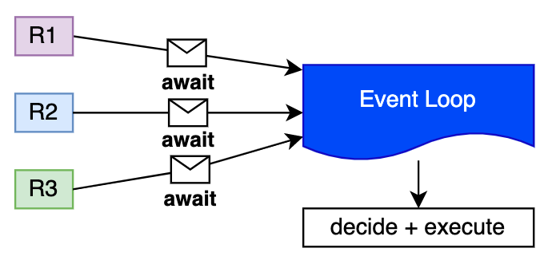

# Python Async in real-life 🐍🔀

Maybe it's just me, but I hate stupid examples. I hate reading about OOP with animal examples as much as I hate reading about async with the client using bare `asyncio.sleep` statements. Mostly because (considering you won't work for a zoo 🤷‍♂️) these examples will never get any close to real life.

I want then to explore async without talking about food (although I'm hungry right now) and using examples that you can actually run yourself and understand.
So, the plan is to:

- Explore `async` with slow HTTP queries;
- Explore `async` with slow Database queries;
- Share a real project running in production that uses `async`;

## 🗺️ Set up

I don't want to start talking about the solution (i.e. async), **I want you to feel the problem first**, I want you to actually run things locally from your own computer.
To create the background we want to simulate I'll be using a repo with all scenarios available on [GitHub](https://github.com/guilatrova/python-async-scenarios) and I strongly recommend you to clone it so you can follow up with me.

```sh
# Clone
git clone https://github.com/guilatrova/python-async-scenarios.git
cd python-async-scenarios

# Create virtualenv
python3 -m virtualenv .venv
source .venv/bin/activate

# Install deps
pip install -r requirements.txt
```

From now on I'll assume you did so. Please, run the commands with me! 😁

## ⏬ HTTP

### 🐌 Slow server

Please, start our silly API server:

```sh
❯ cd API/delay_api
❯ python manage.py runserver
Watching for file changes with StatReloader
Performing system checks...

System check identified no issues (0 silenced).

You have 18 unapplied migration(s). Your project may not work properly until you apply the migrations for app(s): admin, auth, contenttypes, sessions.
Run 'python manage.py migrate' to apply them.
June 06, 2021 - 16:03:09
Django version 3.2.3, using settings 'delay_api.settings'
Starting development server at http://127.0.0.1:8000/
Quit the server with CONTROL-C.
```

It's fine to ignore the warnings regarding migrations.

Now open a new terminal (don't forget to activate the virtualenv) and head to the client dir and execute the sync version of our client:

```sh
cd API/client
python sync.py
```

If everything happens as expected, you should see some output just like:

```sh
❯ python sync.py
==========
R1: Requesting 'http://localhost:8000/delay-me?seconds=10'
R1: Request finally done! Server replied 'Done, I waited for 10 secs'
R2: Requesting 'http://localhost:8000/delay-me?seconds=2'
R2: Request finally done! Server replied 'Done, I waited for 2 secs'
R3: Requesting 'http://localhost:8000/delay-me?seconds=5'
R3: Request finally done! Server replied 'Done, I waited for 5 secs'
----------
Time elapsed: 17.042340711999998
==========
```

Well, please open the `sync.py` code and get familiar with it. Note that we got 3 "requesters" responsible for pulling data from a URL in some server, as soon as they reply we print the response and move on.

**Gui, you liar, you told me you wouldn't be using sleeps!!** There's not really a `sleep` there. Note that **who's actually making our code slower is rather the server** (which let's pretend we can't control) and not the client.

In other words, the server can do anything it wishes, our client is just waiting for it to respond. If it helps, **try to think about it like a long operation triggered by HTTP to some third-party API out of your control.**

Given that context, let's observe how our code behaves across the time:


As you can see below, the only bottleneck is the server response. Making a request and printing its results always take the same amount of time. Keeping our software iddle while waiting for the server to respond is not really great, is it?

### 🐶 Slow server (but optimized)

Now that you observed the issue, you might have realized that **we don't have to wait for every request to finish in order to perform further requests (in our case R2 and R3).** Again, considering we can't touch the server, thus it can't get any faster, the only option is to optimize how we perform the requests. If you bet `async` might help us, then yes, you're right.

In the same directory (`API/client`), you're about to find a file named `async.py`. Before running it I want to highlight some major differences:

```py
import asyncio
import aiohttp  # <-- We use this lib over "requests"

...

class Requester:
    # The method is declared as "async"
    async def pull_from_server(self, secs: int) -> NoReturn:
        ...

        async with aiohttp.ClientSession() as session:
            async with session.get(url) as resp:
                content = await resp.text()  # <-- We use await here
                ...


# The function is declared as "async"
async def main():
    ...

    await asyncio.gather(  # <-- We use asyncio.gather
        r1.pull_from_server(10),
        r2.pull_from_server(2),
        r3.pull_from_server(5)
    )

if __name__ == "__main__":
    asyncio.run(main())  # <-- We use asyncio.run to start our main function
```

Let's execute and see how it performs in comparison to our first example:

```sh
❯ python async.py
==========
R1: Requesting 'http://localhost:8000/delay-me?seconds=10'
R2: Requesting 'http://localhost:8000/delay-me?seconds=2'
R3: Requesting 'http://localhost:8000/delay-me?seconds=5'
R2: Request finally done! Server replied 'Done, I waited for 2 secs'
R3: Request finally done! Server replied 'Done, I waited for 5 secs'
R1: Request finally done! Server replied 'Done, I waited for 10 secs'
----------
Time elapsed: 10.052988270999998
==========
```

Ok, that's a huge performance bump. It took only ~10 secs, which is the time of our slowest request in comparison to ~17 secs.
Note the interesting points:

- All the requests were made right away in the order we specified in code;
- The responses were out of order (first **R2**, then **R3**, and only then **R1** finished);

Now it starts to get interesting, here is where some people mistakenly think this is actually running in parallel, but no, **it's not parallel, it's concurrent.** See:


Hopefully the diagram made it simpler to understand how python async works. **There's no code being run at the same time.**


Everytime we run **`await`** (e.g. `await resp.text()`) we give control back to python (more specifically to the **event loop** as we're going to see soon) to decide what to do in the meantime.

In other words, **async only "works" when you have to wait for IO operations**.

### 🐌 Slow server (with a fake optimization)

Now, you might think that's quite simple: Let's just use `async` whenever I have some IO work!

Well, it's just not enough. You might have noticed we're using the `aiohttp` lib. I'm not using this lib because I prefer it over `requests`, I'm using it because *I have to* in order to perform async operations.

To make that clear and obvious, you can find in the same directory `async_w_sync.py` where it still use `async def` and the `requests` lib.
Note how using `async def` for a method/function does not make it really async.

```bash
❯ python async_w_sync.py
==========
R1: Requesting 'http://localhost:8000/delay-me?seconds=10'
R1: Request finally done! Server replied 'Done, I waited for 10 secs'
R2: Requesting 'http://localhost:8000/delay-me?seconds=2'
R2: Request finally done! Server replied 'Done, I waited for 2 secs'
R3: Requesting 'http://localhost:8000/delay-me?seconds=5'
R3: Request finally done! Server replied 'Done, I waited for 5 secs'
----------
Time elapsed: 17.042022314999997
==========
```

**Declaring a function with `async def` does no magic trick, you need a lib that supports it.**

## 💽 Database

If you're demanding like me, you probably are still unhappy with a shady sleep commmand behind an API.

That's why we're about to use a real database with a real query. It was tricky to make the database/query intentionally slow (e.g. poor indexes, duplicated data, terrible joins), but the point is still valid to simulate and compare sync and async code.

You're free to stop the API server now.

### 🇧🇷 Set up the database

This script will add lots of repeated data about all cities of Brazil. You might want to get some coffee while the script runs.
Let's do this!

```bash
cd database/pgsql
docker compose up

# Switch to another terminal and
cd database/pgsql/scripts
python generatedb.py
# have your coffee now
```

(You can rerun `python generatedb.py` as much as you want to make our scenarios even slower/easier to spot).

The overral structure is the same, so hopefully there won't be anything new other than the query/database.

### 🐌 Slow query

Go ahead and try the sync version:

```bash
❯ cd database/pgsql/client
❯ python sync.py
==========
R1: Querying '
    SELECT c.name, s.state FROM cities c
    JOIN states s ON  c.state_id = s.id
    WHERE s.state IN (
        SELECT state FROM states
    )
    ORDER BY s.long_name, c.name
'
R1: Query made! Db replied '7789600' rows
R2: Querying '
    SELECT c.name, s.state FROM cities c
    JOIN states s ON  c.state_id = s.id
    WHERE c.name like 'A%'
'
R2: Query made! Db replied '575400' rows
R3: Querying '
    SELECT c.name, s.state FROM cities c
    JOIN states s ON  c.state_id = s.id
    WHERE s.state like 'M%' OR s.state like '%P'
'
R3: Query made! Db replied '2730000' rows
----------
Time elapsed: 22.872724297999998
==========
```

Simillarly to the first example, our software only moves on to the next step once the database responds to the query.

### 🐶 Slow query (but optimized)

Let's try the `async` version now:

```bash
❯ python async.py
==========
R1: Querying '
    SELECT c.name, s.state FROM cities c
    JOIN states s ON  c.state_id = s.id
    WHERE s.state IN (
        SELECT state FROM states
    )
    ORDER BY s.long_name, c.name
'
R2: Querying '
    SELECT c.name, s.state FROM cities c
    JOIN states s ON  c.state_id = s.id
    WHERE c.name like 'A%'
'
R3: Querying '
    SELECT c.name, s.state FROM cities c
    JOIN states s ON  c.state_id = s.id
    WHERE s.state like 'M%' OR s.state like '%P'
'
R2: Query made! Db replied '575400' rows
R3: Query made! Db replied '2730000' rows
R1: Query made! Db replied '7789600' rows
----------
Time elapsed: 18.440496856
==========
```

The first interesting thing to notice is how the 3 queries are triggered right away as we wait for the results.

Another point worth mentioning is how **async is no fix for a bottleneck.** The code is still very slow, although we could optimize a bit (dropping from ~22 secs to ~18 secs).

## 🐍 Concurrency, Coroutines and the Event Loop

We saw and executed a lot of python code without really understanding what it does, we're about to get deeper into the theme so we can understand it a bit better. I'll do my best to not make it boring, I swear :) .

So, as you could see, using async doesn't make your code parallel, it's more an **optimization of iddle time** (or concurrent as people prefer to call). We also noticed that making a function `async` when the libs/internal workings are `sync` make no effect at all (it might even get slower)!

### ⏯️ Coroutines

**Coroutines** are functions that can be started, paused, and resumed. Whenever you invoke an `async` function you are getting a coroutine. Try it:

```py
async def anyfunc():
    return 1

r = anyfunc()
print(type(r))
# Output: <class 'coroutine'>
```

Whenever you `await`, you're asking for the event loop to handle that coroutine and return a result to you. Note that coroutines never awaited are never executed. Try:

```py
import asyncio

async def anyfunc():
     return 1

async def main():
     anyfunc()

if __name__ == "__main__":
     asyncio.run(main())
     # Output: RuntimeWarning: coroutine 'anyfunc' was never awaited
```

You still can execute a coroutine by creating a task and getting its result later:

```py
import asyncio

async def anyfunc():
    return 1

async def main():
    r = anyfunc()
    task = asyncio.create_task(r)  # Coroutine is handled to the Event Loop

    print(type(task))
    # Output: <class '_asyncio.Task'>

    print(await task)
    # Output: 1

if __name__ == "__main__":
    asyncio.run(main())
```

> (Note I used a stupid `return 1` statement because the focus is to show how python deals with coroutines. Hopefully by now you understand that this code makes no sense and also understand the why!).

I believe it's time to present you the **Event Loop**.

### 🔁 Event Loop

Think about the event loop as a manager that decides what should happen and what should wait. Every time you invoke `await <coroutine>` you're saying: "Event Loop, please, decide what to do next". By reusing our example on having 3 requesters, that's  how you can imagine the process:



In other words, within a sync program, you just run commands in sequence but programming in async means giving control back to the event loop ocassionally.

From our example, we can imagine commands being executed as:

- sync statements (`print`, `timeit`, etc) are run right away giving **no chance** to the event loop to even think about what to do next;
- casual `await` statements notifying the event loop that it might be a good time to pause and do something else;


Eventually async functions are getting done! Since we used `asyncio.gather` event loop will keep waiting for all the tasks (R1, R3) to move on to completion:


Given that simple explanation, I want to provoke you. What would happen if:

- We have only one `async` requester function running?
- We invoke a coroutine without `await` or `create_task`?
- We used event loop in a program with not a single `async`? (by starting `asyncio.run` without any `await`)

[TWEET HERE]

## 🏍️ Real Life Example

Again I want to make things as real as possible. The scenarios mentioned above are "somewhat real but artificial". Now I'm about to share a case where I actually had to use `async` in production to solve a real problem.

Back when I worked at [Mimic](https://latamlist.com/brazilian-food-delivery-startup-mimic-receives-9m-seed-round/), we allowed our customers to watch their orders being delivered (Damn it I promised we wouldn't be talking about food).

Microservices of third parties like Uber and Rappi provide their own interfaces to notify/poll the courier location (If you're curious to hear how we deal with different third party interfaces you might want to [check this post](https://blog.guilatrova.dev/building-an-agnostic-microservice-architecture-with-kafka/)) so whenever we receive such data, we adapt, and publish it to Redis.

Customers willing to watch their order trip can access a track link that initiates a websocket connection to a Django API that in turn subscribes to a Redis channel. Whenever Redis receives a push notification, Django receives it and send over the websocket to the customer, providing real-time updates.


We created a small wrapper to create/close redis connections and to subscribe to order updates using [`aioredis`](https://github.com/aio-libs/aioredis-py):

```py
import aioredis


class OrderTracker:
    async def get_redis(self):
        if not self.redis:
            self.redis = await aioredis.create_redis_pool(settings.REDIS_HOST)

        return self.redis

    async def subscribe(self, order_id: str):
        redis = await self.get_redis()
        (channel,) = await redis.subscribe(order_id)
        return channel

    async def dispose(self):
        redis = await self.get_redis()
        redis.close()
        await redis.wait_closed()
```

Then we created our websocket interface with [django channels](https://github.com/django/channels):

```py
def notify_client(channel, callback):  # <-- Synchronous function that handles a coroutine to event loop
    async def _handle_message():
        async for message in channel.iter():  # <-- While we wait for Redis to publish something, we're free to do other stuff
            logger.info(f"Got message: {message}")
            await callback(message)  # We await the self.send here (see below)

    # We can just ask Event Loop to handle that by creating a task,
    # We don't want to wait for the result
    asyncio.create_task(_handle_message())


class TrackerConsumer(AsyncWebsocketConsumer):
    async def connect(self):
        ...

        channel = await self.tracker.subscribe(order_id)

        await self.accept()  # <-- Websocket connection initiated

        notify_client(channel, lambda msg: self.send(text_data=msg.decode("utf-8")))  # <-- self.send is a coroutine, intentionally not awaited


    async def disconnect(self, close_code):
        logger.info(f"Connetion closed with {close_code} code")
        await self.tracker.dispose()
```

### 🔖 References

- [Asynchronous Python (2016)](https://medium.com/@nhumrich/asynchronous-python-45df84b82434) 👈 don't let the year make you think it's not worthy, it's best article I've read so far on the theme
- [What is a Coroutine Anyway? - North Bay Python (2019)](https://www.youtube.com/watch?v=GSiZkP7cI80)
- [Python Asynchronous Programming - AsyncIO & Async/Await (2021)](https://www.youtube.com/watch?v=t5Bo1Je9EmE)
- [Python & Async Simplified (2018)](https://www.aeracode.org/2018/02/19/python-async-simplified/)
- [Concurrency (2021)](https://sourcery.ai/blog/concurrency/)
