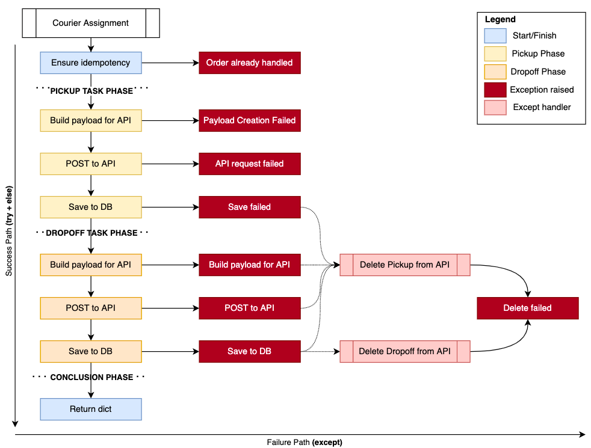
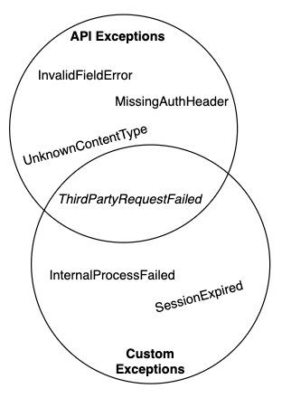
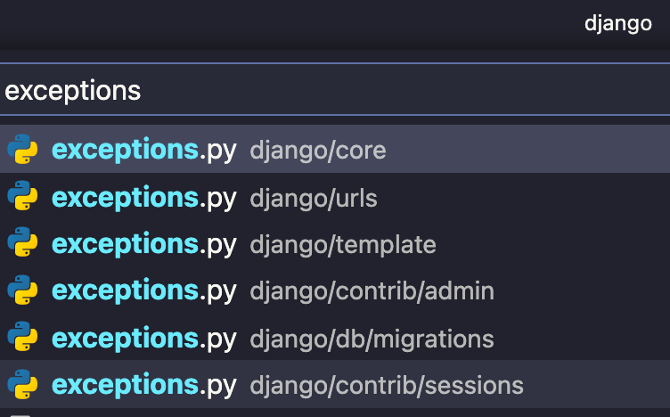

# How to structure exception in Python like a PRO 🐍 🏗️ 💣

Given now you know how to properly [handle your exceptions](https://blog.guilatrova.dev/handling-exceptions-in-python-like-a-pro/) with [Tryceratops 🦖](https://blog.guilatrova.dev/project-tryceratops/) help, the next step is to structure them effectively so you can scale and reuse them.

## 🖼️ What exceptions should represent?

To make it short, exceptions represent: *"SOMETHING EXPECTED happened"*.

You frequently **don't care about precision, but accuracy**. It means that you don't need to know exactly WHY something failed (e.g. bad internet connection? provider is off?), but you should focus on **WHAT failed so you can respond to it**.

I'll start sharing a real-life example. Let me explain the boring business part quickly: Back when I worked at [Mimic](https://latamlist.com/2019/12/15/brazilian-food-delivery-startup-mimic-receives-9m-seed-round/) we used a third-party API named [Onfleet](https://onfleet.com/) to assign orders to couriers. At that time we decided to break it down into two steps:

1. Create a pick-up task (courier taking the order),
2. Create a drop-off task (courier takes the order to the customer).

Different API calls are made, and the latter depends on the first. Anything might go wrong, and if it does we need to **UNDO** anything we've done previously.

Please note the **straight flow from top to bottom**. That's the success path (`try` and `else` block) that may raise exceptions.

Next, consider the **left to right flow**. That's the exception handling path (`except` blocks) that also can raise exceptions.



The production code for this function is exactly as follows:

```py
# Good example
class OnfleetService:
    def create_tasks(self, order: Order) -> dict:
        try:
            self._prevent_tasks_duplicities(order.id)
            pick_up_task = self._create_pick_up_task(order)
            drop_off_task = self._create_drop_off_task(order, pick_up_task)
        except exceptions.StorePickUpTaskFailed as error:
            self._delete_task(error.pick_up_task_id)
            raise
        except exceptions.CreateDropOffTaskFailed:
            self._delete_task(pick_up_task.id)
            raise
        except exceptions.StoreDropOffTaskFailed as error:
            self._delete_task(pick_up_task.id)
            self._delete_task(error.drop_off_task_id)
            raise
        else:
            logger.info("Tasks were created and stored successfully")

            return {
                "pick_up_task": pick_up_task,
                "drop_off_task": drop_off_task,
            }


def handle_incoming_orders(orders: Iterable[Order]):
    for order in orders:
        try:
            logger.debug(f"Received order: {order}")
            onfleet_service.create_tasks(order)
        except exceptions.TasksAlreadyExists:
            pass
```

Note how **we focus on the "WHAT":** `StorePickupTaskFailed`, `CreateDropOffTaskFailed`, `StoreDropOffTaskFailed`.
We (and you shouldn't either) don't care whether the function failed because of bad `JSON` syntax, or their API replied with 400, or the database was unavailable at the moment, or an invalid foreign key issue happened. **All this information will be contained and logged in the stack trace already!**

Instead, my code must REACT to WHAT happens:

- If I can't save the pickup task in my database (for any reason), I need to send a `DELETE` request to remove it from the third-party (otherwise they have a task that our microservice doesn't know about);
- If I can't create the drop off task on their API (for any reason), I need to repeat the same flow above;
- If I can't save the drop off task in my database (for any reason), I need to repeat the same flow above + send another `DELETE` request to remove the drop off as well;

For all the cases we `raise` again because this service layer is not responsible for logging, alarming, or presenting the user a better UI, it's just responsible for mitigating risks to the operation (e.g. Prevent couriers from picking an order without a drop-off, or triggering events we're never able to forward to the end-user like: "the courier is on its way to deliver your order").

It would be hard and probably useless to have very specific exceptions (precision):

```py
# Bad example
class OnfleetService:
    def create_tasks(self, order: Order) -> dict:
        try:
            self._prevent_tasks_duplicities(order.id)
            pick_up_task = self._create_pick_up_task(order)
            drop_off_task = self._create_drop_off_task(order, pick_up_task)
        except (
            exceptions.StorePickupFailedDueDatabaseUnavailable,
            exceptions.StorePickupFailedDueBadForeignKey,
            exceptions.StorePickupFailed,
            exceptions.StorePickupFailedUnknownReason,
        ) as error:
            self._delete_task(error.pick_up_task_id)
            raise
        except (
            exceptions.CreateDropOffTaskBadSyntax,
            exceptions.CreateDropOffTaskMissingProp,
            exceptions.CreateDropOffTaskValidation,
            exceptions.CreateDropOffTaskFailedUnknown
        ):
            self._delete_task(pick_up_task.id)
            raise

        ...
```

Also, they don't even matter. If any of these exceptions are raised, your team needs to investigate it anyway, and I hope they look at the stack trace to find details and figure out root causes.

After all, it's impossible to be prepared for everything. Maybe the database config is wrong, maybe the env variable is not set, etc.

## 🏗️ When to create?

Given that you understand what an exception is and represents, you might feel like it's simple to create them now.

Sometimes is not that clear though. The [Effective Python book on Chapter 2 Item 14](https://amzn.to/3bEVHpG) ["**Prefer exceptions to returning None**"](https://github.com/SigmaQuan/Better-Python-59-Ways/blob/master/item_14_prefer_exceptions.py) for example.

I recommend going beyond that.

If you're constantly checking whether "to proceed" or not, that's probably a good candidate for an exception. The code you saw above could not have any exception and instead be like:

```py
# Bad example
class OnfleetService:
    def create_tasks(self, order: Order) -> Optional[dict]:
        has_duplicities = self._prevent_tasks_duplicities(order.id)

        if has_duplicities:  # May I continue? (1)
            return None

        pickup_task_payload = self._create_pick_up_payload(order)
        if not pickup_task_payload:  # May I continue? (2)
            return None

        pick_up_task = self._create_pick_up_payload(order)
        if pick_up_task:  # May I continue? (3)
            drop_off_task_payload = self._create_drop_off_payload(order, pick_up_task)

            if not drop_off_task_payload:  # May I continue? (4)
                self._delete_task(pick_up_task)
                return None

            drop_off_task = _create_drop_off_task()
            if not drop_off_task_payload:  # May I continue? (5)
                self._delete_task(pick_up_task)
                return None

            logger.info("Tasks were created and stored successfully")

            return {
                "pick_up_task": pick_up_task,
                "drop_off_task": drop_off_task,
            }
```

I assure you this code would work with some "feature losses". The caller now has no visibility of "what went wrong" since it just receives a `None` stating nothing happened (plus needs one more check `if tasks:`), furthermore you lose valuable stack trace that can point out the line, file, and deeper context for the issue you had.

I would like to humbly create a principle for that. Somewhat inspired by the [Tell, Don't Ask](https://martinfowler.com/bliki/TellDontAsk.html) principle.

I'd like to refer to this as **Trigger, Don't Confirm**.

### 🔫 Principle: Trigger, Don't Confirm

Try to follow this principle whenever you break it (at least) twice in any function or method. I state it as follows:

**Good** (Respects principle)

Represents any moment where you can trust a function will either return the result or raise an exception.

e.g.

```py
try:
    result = maybe_will_work()
    keep_flow(result)  # <-- Respects principle, no checks
except WorkFailed:
    ...
```

**Bad** (Breaks principle)

Represents any time that you give a command (e.g. invokes a method), but you're required to check whether the result is set/correct to continue your flow.

e.g.

```py
result = maybe_will_work()
if result:  # <-- Breaks principle
    keep_flow(result)
```

## 🦴 Exceptions structure

The [Effective Python book on Chapter 7 Item 51](https://amzn.to/3bEVHpG) suggests ["**Define a root exception to insulate callers from APIs**"](https://github.com/SigmaQuan/Better-Python-59-Ways/blob/master/item_51_define_a_root_exception.py), which means in my humble opinion "categorizing" your exceptions.

### 🔖 Categorizing

Always start with a base exception for a specific "module" or domain. It means having a (maybe) dummy base and keep extending it.

Here are more real-world examples:

```py
# Dummy category
class OnfleetTasksException(Exception):
    pass


# Base group category
class StoreTaskFailed(OnfleetTasksException):
    def __init__(self):
        message = "Storing task at the database error"  # Defines default message that can be overwritten
        super().__init__(message)


# Specific WHAT exception
class StorePickUpTaskFailed(StoreTaskFailed):
    def __init__(self, order_id, pick_up_id):
        message = (  # Sets specific message intended for engineers to debug
            "An error occurred while storing pickup task info into the database\n"
            f"Order ID: {order_id}\n"
            f"Pickup task ID: {pick_up_id}"
        )
        self.pick_up_task_id = pick_up_id  # Sets context
        super().__init__(message)


# Specific WHAT exception
class StoreDropOffTaskFailed(StoreTaskFailed):
    def __init__(self, order_id, pick_up_id, drop_off_id):
        message = (  # Sets specific message intended for engineers to debug
            "An error occurred while storing drop off task info into the database\n"
            f"Order ID: {order_id}\n"
            f"Pickup task ID: {pick_up_id}\n"
            f"Dropoff task ID: {drop_off_id}"
        )
        self.drop_off_task_id = drop_off_id  # Sets context
        super().__init__(message)
```

This structure allows you to either isolate known from unknown and to handle them by category:

#### Isolate known exceptions from unknown:

By doing that you can trigger different kinds of alarms:

```py
try:
    do_work()
except OnfleetTasksException:
    logger.exception("Something known happened")
except Exception:
    logger.critical("Something UNEXPECTED happened", exc_info=True)
```

In general, an unknown error is very serious and requires an immediate response because it means that for sure your software can't heal itself.

#### Handle exceptions by category:

You can have different response to different group of issues:

```py
try:
    do_work()
except StoreTaskFailed:
    alert_data_team("Some database operation failed")
except OnfleetApiFailed as error:
    alert_support_team(f"A request to '{error.endpoint}' failed with {error.status_code} status code")
```

We can trigger different alerts based on the group of issue. For this case you got: Database or API groups.

### 🏷️ Exceptions are beyond messages, they provide context

Ensure that the exception you're creating can give you context. "Request failed" is too shallow - what request? what endpoint? what response did we get?

You might have noticed that we can extract relevant data from exceptions to handle issues, like:

```py
try:
    ...
except exceptions.StorePickUpTaskFailed as error:
    self._delete_task(error.pick_up_task_id)  # <-- extract id for delete
except exceptions.StoreDropOffTaskFailed as error:
    self._delete_task(error.drop_off_task_id) # <-- extract id for delete

# OR

try:
    ...
except OnfleetApiFailed as error:
    alert_support_team(f"A request to '{error.endpoint}' failed with {error.status_code} status code")  # <-- Extract endpoint/status code
```

Always ask yourself: "If this exception is raised, what do I need to know to keep investigating, or to prevent the issue from getting worse?"

### ↔️ Combine exceptions

By having specific exceptions you can also combine them with more thanks to Python's support to multiple inheritance.

For example, in [Django](https://github.com/django/django) with [Django Rest Framework](https://www.django-rest-framework.org/), If you wish to raise a specific exception with a custom message, but also trigger a `503` status code you can inherit from [`APIException`](https://www.django-rest-framework.org/api-guide/exceptions/#apiexception):

```py
class OnfleetApiFailed(APIException, OnfleetTasksException):  # <-- Inherit from 2 instances, belongs to 2 groups
    status_code = 503  # <-- property used by API Exception
    default_detail = 'Onfleet temporarily unavailable, try again later.'  # <-- property used by API Exception
    default_code = 'service_unavailable'  # <-- property used by API Exception

    def __init__(self, endpoint, onfleet_response_status_code):
        ...
```

You keep your original grouping (belongs to your system API exception), and allows the framework (DRF in this case) to handle it.



You don't need to be restrained by the framework you use. You can create your own set of "Authorization", "UserManualAction", "UserFriendly" exceptions and treat them as such regardless of specific details.

And then you can:

```py
try:
    do_work()
except UserManualAction as error:
    # Several exceptions in this system may require users to take some manual steps.
    # Such group supports 'email_body' and 'send_to' fields.
    # For those groups, send an email to notify them.
    send_email(error.email_body, error.send_to)
```

### 📥 Where to place exceptions

Keep exceptions in the same modules that raise them. Often you want to put a "generic group exception" at top-level and more specific ones close to a logical module.

Example:

```
┌─ src/
│  ├─ core
│  │  ├─ __init__.py
│  │  ├─ settings.py
│  │  └─ exceptions.py  # <-- Base for all defined exceptions
│  │
│  ├─ api
│  │  ├─ __init__.py
│  │  ├─ onfleet.py
│  │  └─ exceptions.py  # <-- API exceptions
│  │
│  └─ models
│     ├─ __init__.py
│     ├─ tasks.py
│     └─ exceptions.py  # <-- Model exceptions
│
├─ README.md
└─ requirements.txt
```

This makes imports clear:

```py
from models import tasks, exceptions  # Obvious because it comes from 'models'
from api.exceptions import OnfleetApiFailed  # Also clear and expected
```

#### How it compares to other libs

[**Django**](https://docs.djangoproject.com/en/3.2/ref/exceptions/) also splits exceptions by "modules":



Django is very interesting because it allows you to identify a [**specific model** that does not exists](https://docs.djangoproject.com/en/3.2/ref/models/class/#doesnotexist).

[**SQLAlchemy**](https://github.com/sqlalchemy/sqlalchemy) is a bit different, but also has a similar structure. It splits exceptions into [core](https://docs.sqlalchemy.org/en/14/core/exceptions.html) and [ORM](https://docs.sqlalchemy.org/en/14/orm/exceptions.html), and most exceptions inherit from the base (not dummy though) `SQLAlchemyError`.

## 💓 Do you love real-life examples?

If you're like me and prefer **real-world examples** like the above **I have something for you**. I take most of my examples from my daily work, and they're very close to the real code, except by critical or private data for obvious (and contractual) reasons.

If you enjoy such examples, you might want to follow me on [Twitter](https://twitter.com/guilatrova/), where I share several tips and real-life code that doesn't fit in a blog post format. Here, take an example:

https://twitter.com/guilatrova/status/1416229315038044160
