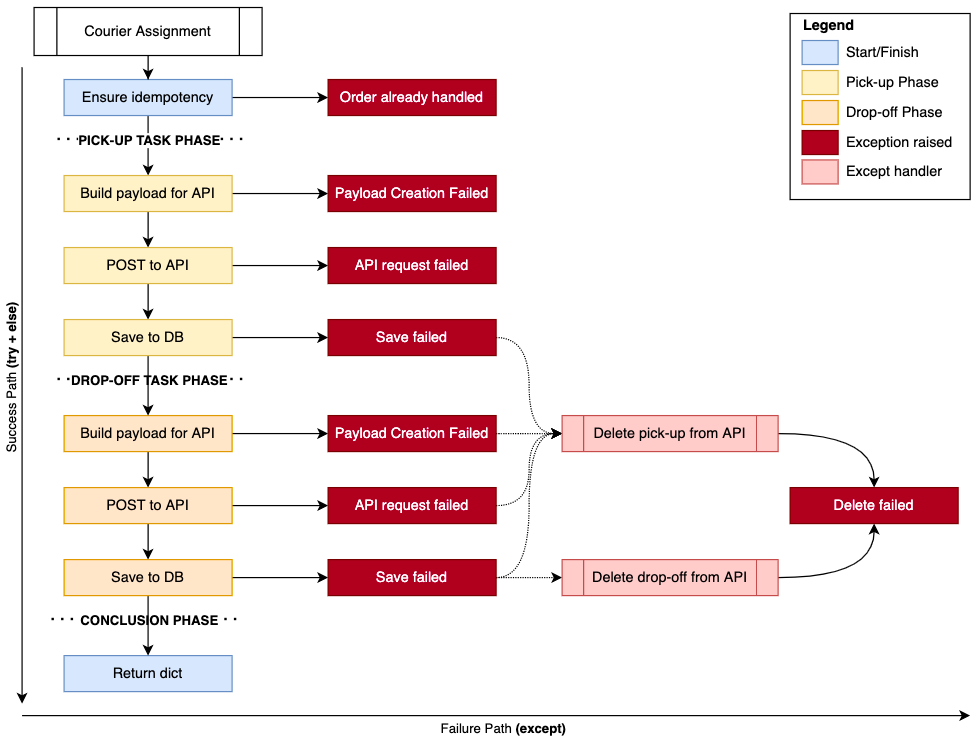

# How to structure exception in Python like a PRO 🐍 🏗️ 💣

Given now you know how to properly [handle your exceptions](https://blog.guilatrova.dev/handling-exceptions-in-python-like-a-pro/) with [Tryceratops 🦖](https://blog.guilatrova.dev/project-tryceratops/) help, the next step is to structure them effectivelly so you can scale and reuse.

## What exceptions should represent?

To make it short, exceptions represent: *"SOMETHING EXPECTED happened"*.

You frequently **don't care about precision, but accuracy**. It means that you don't need to know exactly WHY something failed (e.g. bad internet connection? provider is off?), but you should focus on **WHAT failed so you can respond to**.

I'll start sharing a real-life example. Let me explain the boring bussiness part quick: Back when I worked at [Mimic](https://latamlist.com/2019/12/15/brazilian-food-delivery-startup-mimic-receives-9m-seed-round/) we used a third-party API named [Onfleet](https://onfleet.com/) to assign orders to couriers. At that time we decided to break it down into two steps:

1. Create a pick-up task (courier taking the order),
2. Create a drop-off task (courier takes the order to the customer).

Different API calls are made, and the latter depends on the first. Anything might go wrong, and if it does we need to **UNDO** anything we've done previously.

Please note the **straight flow from top to bottom**. That's the success path (`try` and `else` block) that may raise exceptions.

Next, consider the **left to right flow**. That's the exception handling path (`except` blocks) that also can raise exceptions.



The production code for this function is exactly as follows:

```py
# Good example
class OnfleetService:
    def create_tasks(self, order: Order) -> dict:
        try:
            self._prevent_tasks_duplicities(order.id)
            pick_up_task = self._create_pick_up_task(order)
            drop_off_task = self._create_drop_off_task(order, pick_up_task)
        except exceptions.StorePickUpTaskFailed as error:
            self._delete_task(error.pick_up_task_id)
            raise
        except exceptions.CreateDropOffTaskFailed:
            self._delete_task(pick_up_task.id)
            raise
        except exceptions.StoreDropOffTaskFailed as error:
            self._delete_task(pick_up_task.id)
            self._delete_task(error.drop_off_task_id)
            raise
        else:
            logger.info("Tasks were created and stored successfully")

            return {
                "pick_up_task": pick_up_task,
                "drop_off_task": drop_off_task,
            }


def handle_incoming_orders(orders: Iterable[Order]):
    for order in orders:
        try:
            logger.debug(f"Received order: {order}")
            onfleet_service.create_tasks(order)
        except exceptions.TasksAlreadyExists:
            pass
```

Note how **we focus on the "WHAT":** `StorePickupTaskFailed`, `CreateDropOffTaskFailed`, `StoreDropOffTaskFailed`.
We (and you shouldn't either) don't care whether the function failed because of bad `json` syntax, or their API replied with 400, or the database was unavailable at the moment, or an invalid foreign key issue happened. **All this information will be contained and logged in the strack trace already!**

Instead, my code must REACT to WHAT happens:

- If I can't save the pick up task in my database (for any reason), I need to send a `DELETE` request to remove it from the third-party (otherwise they have a task that our microservice doesn't know about);
- If I can't create the drop off task on their API (for any reason), I need to repeat the same flow above;
- If I can't save the drop off task in my database (for any reason), I need to repeat the same flow above + send another `DELETE` request to remove the drop off as well;

For all the cases we `raise` again because this service layer is not responsible for logging, alarming, or presenting the user a better UI, it's just responsible for mitigating risks to the operation (e.g. Prevent couriers from picking an order without a drop off, or trigerring events we're never able to forward to the end user like: "the courier is on its way to deliver your order").

It would be hard and probably useless to have very specific exceptions (precision):

```py
# Bad example
class OnfleetService:
    def create_tasks(self, order: Order) -> dict:
        try:
            self._prevent_tasks_duplicities(order.id)
            pick_up_task = self._create_pick_up_task(order)
            drop_off_task = self._create_drop_off_task(order, pick_up_task)
        except (
            exceptions.StorePickupFailedDueDatabaseUnavailable,
            exceptions.StorePickupFailedDueBadForeignKey,
            exceptions.StorePickupFailed,
            exceptions.StorePickupFailedUnknownReason,
        ) as error:
            self._delete_task(error.pick_up_task_id)
            raise
        except (
            exceptions.CreateDropOffTaskBadSyntax,
            exceptions.CreateDropOffTaskMissingProp,
            exceptions.CreateDropOffTaskValidation,
            exceptions.CreateDropOffTaskFailedUnknown
        ):
            self._delete_task(pick_up_task.id)
            raise

        ...
```

Also, they don't even matter. If any of these exceptions are raised, your team needs to investigate it anyway, and I hope they look at the stack trace to find details and figure out root causes.

After all, it's impossible to be prepared for everything. Maybe the database config is wrong, maybe the env variable is not set, etc.

## When to create?

Given that you understand what an exception is and represents, you might feel like it's simple to create them now.

Sometimes is not that clear though. The Effective Python book on Chapter 2 Item 14 [**Prefer exceptions to returning None**](https://github.com/SigmaQuan/Better-Python-59-Ways/blob/master/item_14_prefer_exceptions.py) for example.

I recommend going beyond that.

If you're constantly checking whether "to proceed" or not, that's probably a good candidate for an exception. The code you saw above could not have any exception and instead be like:

```py
# Bad example
class OnfleetService:
    def create_tasks(self, order: Order) -> Optional[dict]:
        has_duplicities = self._prevent_tasks_duplicities(order.id)

        if has_duplicities:  # May I continue? (1)
            return None

        pickup_task_payload = self._create_pick_up_payload(order)
        if not pickup_task_payload:  # May I continue? (2)
            return None

        pick_up_task = self._create_pick_up_payload(order)
        if pick_up_task:  # May I continue? (3)
            drop_off_task_payload = self._create_drop_off_payload(order, pick_up_task)

            if not drop_off_task_payload:  # May I continue? (4)
                self._delete_task(pick_up_task)
                return None

            drop_off_task = _create_drop_off_task()
            if not drop_off_task_payload:  # May I continue? (5)
                self._delete_task(pick_up_task)
                return None

            logger.info("Tasks were created and stored successfully")

            return {
                "pick_up_task": pick_up_task,
                "drop_off_task": drop_off_task,
            }
```

I assure you this code would work with some "feature losses". The caller now has no visiblity of "what went wrong" since it just receives a `None` stating nothing happened (plus needs one more check `if tasks:`), furthermore you lose valuable stacktrace that can point out the line, file and deeper context for the issue you had.

I would like to humbly create a principle for that. Somewhat inspired by the [Tell, Don't Ask](https://martinfowler.com/bliki/TellDontAsk.html) principle.

I'd like to refer to this as **Trigger, Don't Confirm**.

### Principle: Trigger, Don't Confirm

**Good** (Respects principle)

Represents any time that you can trust a function will either return the result or raise an exception.

e.g.

```py
try:
    result = maybe_will_work()
    keep_flow(result)  # <-- Respects principle, no checks
except WorkFailed:
    ...
```

**Bad** (Breaks principle)

Represents any time that you give a command (e.g. invokes a method), but you're required to check whether the result is intended to continue your flow.

e.g.

```py
result = maybe_will_work()
if result:  # <-- Breaks principle
    keep_flow(result)
```

## How to structure them

You might have noticed that we are able to extract data form the e


## Real-life examples

## Extending and categorizing

## Where to keep them
